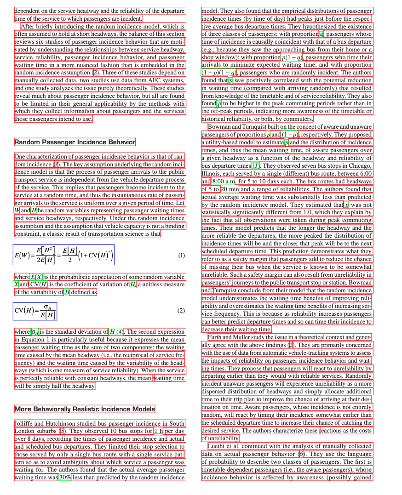

## 概览
`magic-pdf` 命令执行后除了输出和 markdown 有关的文件以外，还会生成若干个和 markdown 无关的文件。现在将一一介绍这些文件


### layout.pdf 
每一页的 layout 均由一个或多个框组成。 每个框左上脚的数字表明它们的序号。此外 layout.pdf 框内用不同的背景色块圈定不同的内容块。


### spans.pdf 
根据 span 类型的不同，采用不同颜色线框绘制页面上所有 span。该文件可以用于质检，可以快速排查出文本丢失、行间公式未识别等问题。




### model.json

#### 结构定义
```python
from pydantic import BaseModel, Field
from enum import IntEnum

class CategoryType(IntEnum):
     title = 0               # 标题
     plain_text = 1          # 文本
     abandon = 2             # 包括页眉页脚页码和页面注释
     figure = 3              # 图片
     figure_caption = 4      # 图片描述
     table = 5               # 表格
     table_caption = 6       # 表格描述
     table_footnote = 7      # 表格注释
     isolate_formula = 8     # 行间公式
     formula_caption = 9     # 行间公式的标号 
     
     embedding = 13          # 行内公式
     isolated = 14           # 行间公式
     text = 15               # ocr 识别结果
   
     
class PageInfo(BaseModel):
    page_no: int = Field(description="页码序号，第一页的序号是 0", ge=0)
    height: int = Field(description="页面高度", gt=0)
    width: int = Field(description="页面宽度", ge=0)

class ObjectInferenceResult(BaseModel):
    category_id: CategoryType = Field(description="类别", ge=0)
    poly: list[float] = Field(description="四边形坐标, 分别是 左上，右上，右下，左下 四点的坐标")
    score: float = Field(description="推理结果的置信度")
    latex: str | None = Field(description="latex 解析结果", default=None)
    html: str | None = Field(description="html 解析结果", default=None)
  
class PageInferenceResults(BaseModel):
     layout_dets: list[ObjectInferenceResult] = Field(description="页面识别结果", ge=0)
     page_info: PageInfo = Field(description="页面元信息")
    
    
# 所有页面的推理结果按照页码顺序依次放到列表中即为 minerU 推理结果
inference_result: list[PageInferenceResults] = []

```

#### 示例数据

```json
[
    {
        "layout_dets": [
            {
                "category_id": 2,
                "poly": [
                    99.1906967163086,
                    100.3119125366211,
                    730.3707885742188,
                    100.3119125366211,
                    730.3707885742188,
                    245.81326293945312,
                    99.1906967163086,
                    245.81326293945312
                ],
                "score": 0.9999997615814209
            }
        ],
        "page_info": {
            "page_no": 0,
            "height": 2339,
            "width": 1654
        }
    },
    {
        "layout_dets": [
            {
                "category_id": 5,
                "poly": [
                    99.13092803955078,
                    2210.680419921875,
                    497.3183898925781,
                    2210.680419921875,
                    497.3183898925781,
                    2264.78076171875,
                    99.13092803955078,
                    2264.78076171875
                ],
                "score": 0.9999997019767761
            }
        ],
        "page_info": {
            "page_no": 1,
            "height": 2339,
            "width": 1654
        }
    }
]
```


### middle.json

#### 结构说明

```python
from pydantic import BaseModel, Field
from enum import StrEnum


class SpanType(StrEnum):
    image = "image"
    table = "table"
    text = "text"
    inline_equation = "inline_equation"
    interline_equation = "interline_equation"


class Span(BaseModel):
    bbox: list[float] = Field(description="四边形坐标, 分别是 左上，右下坐标")
    type: SpanType = Field(description="span 类型")
    content: str | None = Field(description="span 内容", default=None)
    img_path: str | None = Field(description="截图路径", default=None)
    score: float = Field(description="推理结果的置信度")


class Line(BaseModel):
    bbox: list[float] = Field(description="四边形坐标, 分别是 左上，右下坐标")
    spans: list[Span] = Field(description="该行所有的 spans")


class Lv2BlockType(StrEnum):
    discarded = "discarded"
    image_body = "image_body"
    image_caption = "image_caption"
    table_body = "table_body"
    table_caption = "table_caption"
    table_footnote = "table_footnote"
    text = "text"
    title = "title"
    interline_equation = "interline_equation"


class Lv2Block(BaseModel):
    type: Lv2BlockType = Field(description="block 类型")
    bbox: list[float] = Field(description="四边形坐标, 分别是 左上，右下坐标")
    lines: list[Line] = Field(description="该 block 所有的 lines")


class Lv1BlockType(StrEnum):
    image = "image"
    table = "table"


class Lv1Block(BaseModel):
    type: Lv1BlockType = Field(description="block 类型")
    bbox: list[float] = Field(description="四边形坐标, 分别是 左上，右下坐标")
    blocks: list[Lv2Block] = Field(description="该 block 所有的次级 blocks")


class LayoutBoxType(Str):
    v = "V"  # 垂直
    h = "H"  # 水平


class LayoutBox(BaseModel):
    layout_bbox: list[float] = Field(description="四边形坐标, 分别是 左上，右下坐标")
    layout_label: LayoutBoxtype = Field(description="layout 标签")


class PdfInfo(BaseModel):
    preproc_blocks: list[Lv2Block] = Field(description="pdf预处理后，未分段的中间结果")
    layout_bboxes: list[LayoutBox] = Field(description="布局分割的结果，含有布局的方向（垂直、水平），和bbox，按阅读顺序排序")
    para_blocks: list[Lv1Block] = Field(description="将preproc_blocks进行分段之后的结果")
    discarded_blocks: list[Lv2Block] = Field(description="弃用 blocks")
    interline_equations: list[Lv2Block] = Field(description="行间公式 blocks")
    tables: list[Lv2Block] = Field(description="表格 blocks")
    images: list[Lv2Block] = Field(description="图片 blocks")
    _layout_tree: dict = Field(desciption="内部使用，请忽略")
    page_size: list[float] = Field(desciption="页面的宽度和高度")
    page_idx: int = Field(desciption="页码，从 0 开始")
```


